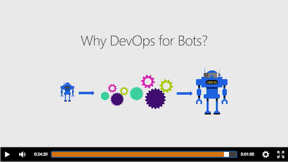

# BotInsightsTests

These bot samples were used in the [DevOps for the Bot Framework](https://channel9.msdn.com/Series/DevOps-for-the-Bot-Framework) video series.

They are based on the core-AppInsights sample from [BotBuilder-Samples](http://github.com/botbuilder-samples) with added unit tests using mocks (node and c#) and functional tests (c#), ARM template, and VSTS Build and Release definitions.

This demo is used throughout the 'DevOps for the Bot Framework' video series:

[https://channel9.msdn.com/Series/DevOps-for-the-Bot-Framework](https://channel9.msdn.com/Series/DevOps-for-the-Bot-Framework)
